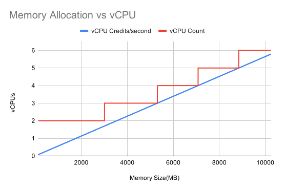

# AWS Lambda cpuinfo

AWS lambda allocates vCPU counts at specific memory thresholds, but it scales vCPU credits linearly.

This results in some interesting performance characteristics at different memory settings.

This repository is a serverless project with a single function that returns info on the CPU using `py-cpuinfo`. It is designed to be deployed as many AWS lambda functions with different memory allocations. 

`serverless.yml` is generated using a jinja2 template for consistency. 

# Results
The [documentation](https://docs.aws.amazon.com/lambda/latest/dg/configuration-memory.html) states that at 1769MB memory allocation, the function is assigned 1 vCPU's worth of vCPU credits.

With a linear progression from 1769MB, vCPU credit thresholds would be:

| Memory (MB) | Credits (vCPU/second)        |
|-------------|------------------------------|
| 1769        | 1                            |
| 3538        | 2                            |
| 5307        | 3                            |
| 7076        | 4                            |
| 8845        | 5                            |
| 10240       | 5.79*                        |

\* 6 vCPU credit allocation would be at 10614MB , over the max threshold of 10240 MB

The CPU counts change at slightly different thresholds:

| Memory (MB)   | vCPU Count |
|---------------|------------|
| 128 - 3008    | 2          |
| 3009 - 5307   | 3          |
| 5308 - 7076   | 4          |
| 7077 - 8845   | 5          |
| 8846 - 10240  | 6          |

# Why is this important?

This can lead to degraded performance if your application expects unthrottled multi-core performance, and your memory allocation doesn't provide enough credits to sustain all cores described. 

Likewise, This opens up a new category of price-performance tuning, since highly threadable workflows can benefit from additional core assignments without a linear increase in price. 

## Development

* `pipenv install --dev`
* Use `pipenv run generate_sls` to dynamically generate thresholded config
* deploy serverless app `sls deploy`
* test endpoints and check `$.count`